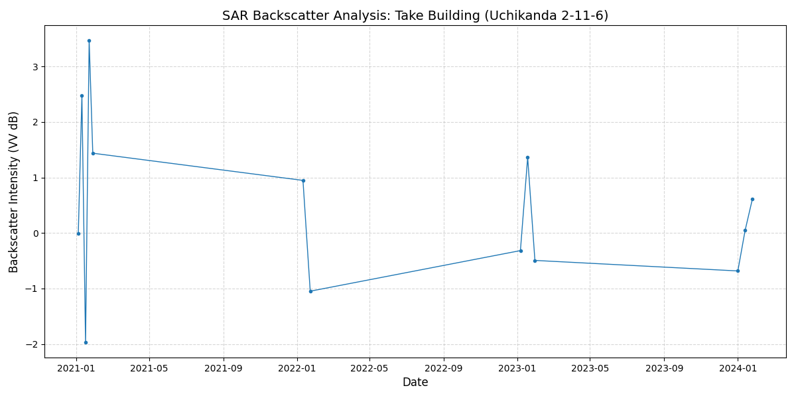

# Aging Infrastructure Analysis Demo

衛生データを利用した特定地域のインフラ分析ツールのデモ

## Preperation

- Googleプロジェクト作成
- Google Earth Engine APIを有効化

## Installation

### 開発環境の構築

作業時間目安: 10分

```
# conda環境を作る場合
## condaインストール
brew install --cask anaconda
/opt/homebrew/anaconda3/bin/conda init bash
source ~/.bash_profile
sudo chown -R $(whoami) ~/.conda

## 環境作成
conda create -n geo-env python=3.10
...
Do you accept the Terms of Service (ToS) for https://repo.anaconda.com/pkgs/main? 
[(a)ccept/(r)eject/(v)iew]: a
Do you accept the Terms of Service (ToS) for https://repo.anaconda.com/pkgs/r? [(a)ccept/(r)eject/(v)iew]: a
...
The following NEW packages will be INSTALLED:

  bzip2              pkgs/main/osx-arm64::bzip2-1.0.8-h80987f9_6 
...
Proceed ([y]/n)? y


conda activate geo-env
pip install earthengine-api geemap python-dotenv

conda install -c conda-forge ipywidgets ipyleaflet
```

## Use

1. 千代田区周辺のマップ
```
python map_chiyoda.py
```


2. 竹ビル周辺の経年劣化グラフ


```
python sar_take_building.py
```

抽出したデータの「反射強度（VV）」の変化をグラフ化する。強度の著しい低下や不安定な変動は、建物の表面状態の変化や構造的な歪みの兆候として解釈できる。




3. 千代田区全体の沈下マップ

```
python risk_map_chiyoda.py
open risk_map_chiyoda.html
```


マップの読み方：

- 赤いエリア: 3年間で反射が弱くなった場所。
  - もしここが「古いビル」や「高架下」であれば、構造的な劣化や剥落、あるいは周辺環境の変化によるリスクを疑うポイントになります。
- 青いエリア: 新しく構造物が建った、または密度が上がった場所。